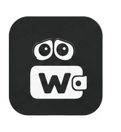

<p align="center">
  
</p>

<h1 align="center">
  
  Wall-i
</h1>

<p align="center">
  <b>Your Money, Under Control</b><br/>
  A personal mobile wallet app built with React Native & Expo
</p>

<p align="center">
  
  
  
  
  
</p>

---

## ✨ Features

| Feature | Description |
|---|---|
| 💰 **Balance Tracker** | View current balance, log spending, and deposit funds |
| 🛍️ **Shopping List** | Built-in checklist that deducts cost on item check-off |
| 📊 **Statistics** | Monthly spending chart with category breakdown |
| 🔐 **PIN Lock** | Secure the app with a personal PIN |
| 📋 **Transaction History** | Browse, filter, and search past transactions |
| 📤 **CSV Export** | Export transactions as CSV or plain text |
| 🎨 **Dark Theme** | Sleek dark UI with smooth animations & haptic feedback |

---

## 📸 Screenshots

> _Screenshots coming soon_

---

## 🛠️ Tech Stack

- **Framework:** [React Native](https://reactnative.dev/) + [Expo SDK 56](https://expo.dev/)
- **Language:** TypeScript
- **Navigation:** [React Navigation](https://reactnavigation.org/) (Bottom Tabs)
- **Storage:** [AsyncStorage](https://react-native-async-storage.github.io/async-storage/)
- **Icons:** [@expo/vector-icons](https://icons.expo.fyi/) (Ionicons)
- **Dev Environment:** Ubuntu GNOME + Expo Go (Android)

---

## 🎨 Design System

| Token | Value |
|---|---|
| Background | `#0F0F1E` |
| Card | `#1A1A2E` |
| Accent | `#6C63FF` |
| Success | `#4CAF50` |
| Danger | `#FF6B6B` |
| Currency | ৳ (Bangladeshi Taka) |

---

## 🚀 Getting Started

### Prerequisites

- [Node.js](https://nodejs.org/) 18+
- [Expo CLI](https://docs.expo.dev/get-started/installation/)
- [Expo Go](https://expo.dev/client) app on your Android device

### Installation

```bash
# Clone the repo
git clone https://github.com/Rezwanul-islam-69/wall-i.git
cd wall-i

# Install dependencies
npm install

# Start the dev server
npx expo start
```

Then scan the QR code with **Expo Go** on your Android device.

---

## 📁 Project Structure

```
wall-i/
├── app/                  # App screens & navigation
│   ├── (tabs)/
│   │   ├── index.tsx     # Home screen (balance + transactions)
│   │   ├── deposit.tsx   # Deposit screen
│   │   ├── shopping.tsx  # Shopping checklist
│   │   └── stats.tsx     # Statistics & summary
│   └── pin.tsx           # PIN lock screen
├── components/           # Reusable UI components
├── hooks/                # Custom React hooks
├── utils/                # Helper functions & storage
├── assets/               # Images, fonts, icons
└── constants/            # Theme colors, config
```

---

## 🗺️ Roadmap

- [x] Home screen — balance, spend modal, transaction history
- [x] Deposit screen
- [x] Shopping checklist with cost deduction
- [x] Statistics screen — monthly chart & category breakdown
- [ ] PIN lock screen
- [ ] UI polish — animations & haptic feedback
- [ ] Transaction history filtering
- [ ] CSV / text export
- [x] Multi-currency support
- [ ] Cloud backup / sync
- [ ] Widget support

---

## 📄 License

```
MIT License

Copyright (c) 2025 Rezwanul Islam

Permission is hereby granted, free of charge, to any person obtaining a copy
of this software and associated documentation files (the "Software"), to deal
in the Software without restriction, including without limitation the rights
to use, copy, modify, merge, publish, distribute, sublicense, and/or sell
copies of the Software, and to permit persons to whom the Software is
furnished to do so, subject to the following conditions:

The above copyright notice and this permission notice shall be included in all
copies or substantial portions of the Software.

THE SOFTWARE IS PROVIDED "AS IS", WITHOUT WARRANTY OF ANY KIND, EXPRESS OR
IMPLIED, INCLUDING BUT NOT LIMITED TO THE WARRANTIES OF MERCHANTABILITY,
FITNESS FOR A PARTICULAR PURPOSE AND NONINFRINGEMENT. IN NO EVENT SHALL THE
AUTHORS OR COPYRIGHT HOLDERS BE LIABLE FOR ANY CLAIM, DAMAGES OR OTHER
LIABILITY, WHETHER IN AN ACTION OF CONTRACT, TORT OR OTHERWISE, ARISING FROM,
OUT OF OR IN CONNECTION WITH THE SOFTWARE OR THE USE OR OTHER DEALINGS IN THE
SOFTWARE.
```

---

<p align="center">
  Made with ❤️ using React Native & Expo
</p>
